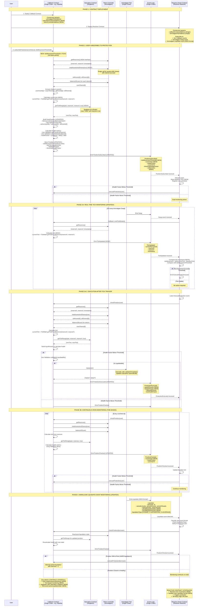

```mermaid
sequenceDiagram
    participant User
    participant CallbackContract as Callback Contract<br/>(Origin Chain - e.g. Sepolia)
    participant Saturation as Saturation Contract<br/>(Singleton)
    participant TokenController as Token Controller<br/>(Ammalgam)
    participant AmmalgamPair as Ammalgam Pair<br/>(Origin Chain)
    participant Events as Event Logs<br/>(Origin Chain)
    participant ReactiveContract as Reactive Smart Contract<br/>(Reactive Network)

    Note over User,ReactiveContract: PHASE 1: CONTRACT DEPLOYMENT

    User->>CallbackContract: 1. Deploy Callback Contract
    Note over CallbackContract: Constructor params:<br/>- ammalgamPairAddress<br/>- saturationContractAddress (NEW)<br/>- tokenControllerAddress (NEW)

    User->>ReactiveContract: 2. Deploy Reactive Contract
    Note over ReactiveContract: Constructor params:<br/>- callbackContractAddress (Origin)<br/>- ammalgamPairAddress (Origin)<br/><br/>Subscribe to:<br/>✓ ALL Callback events<br/>✓ Ammalgam Swap event<br/>✓ Ammalgam Liquidate event (NEW format)

    Note over User,ReactiveContract: PHASE 2: USER SUBSCRIBES TO PROTECTION

    User->>CallbackContract: 3. subscribeProtection(cronInterval, tickMovementThreshold)
    Note over CallbackContract: NEW: tickMovementThreshold in TICKS<br/>(not basis points)

    CallbackContract->>TokenController: getReserves() (NEW interface)
    TokenController-->>CallbackContract: (reserveX, reserveY, timestamp)

    CallbackContract->>TokenController: totalAssetsAndShares(true) (NEW!)
    Note over TokenController: Single call for assets AND shares<br/>with interest accrued
    TokenController-->>CallbackContract: (allAssets[6], allShares[6])

    CallbackContract->>TokenController: balanceOf(user) for each token[6]
    TokenController-->>CallbackContract: userShares[6]

    CallbackContract->>CallbackContract: Convert shares to assets:<br/>userAssets[i] = (userShares[i] * allAssets[i]) / allShares[i]

    CallbackContract->>CallbackContract: Calculate current tick (NEW!):<br/>currentTick = TickMath.getTickFromReserves(reserveX, reserveY)

    CallbackContract->>Saturation: getTickRange(pair, reserveX, reserveY, true) (NEW!)
    Note over Saturation: Singleton for all pairs<br/>Uses TWAP with long-term tick
    Saturation-->>CallbackContract: (minTick, maxTick)

    CallbackContract->>CallbackContract: Build InputParams (UPDATED!):<br/>- Remove activeLiquidityScalerInQ72<br/>- Use sqrtPrice from ticks<br/>- activeLiquidity = allAssets[0] - allAssets[3]

    CallbackContract->>CallbackContract: Calculate health metrics:<br/>- Use Validation.getCheckLtvParams()<br/>- Use Validation.calcDebtAndCollateral()<br/>- healthFactor = (collateral * 9000) / debt

    CallbackContract->>CallbackContract: Store Position (UPDATED!):<br/>- tickMovementThreshold (in ticks)<br/>- lastTick (baseline tick)<br/>- lastHealthFactor<br/>- thresholdHealthFactor

    CallbackContract->>Events: Emit PositionSubscribed (UPDATED)
    Note over Events: PositionSubscribed:<br/>- tickMovementThreshold (NEW)<br/>- currentTick (NEW)<br/>- healthFactor<br/>- currentLTV<br/>- thresholdHealthFactor<br/>- collateralInL<br/>- debtInL

    Events-->>ReactiveContract: PositionSubscribed received

    ReactiveContract->>ReactiveContract: Decode event<br/>Store baseline TICK (NEW)<br/>Register cron schedule

    alt Health Factor Below Threshold
        ReactiveContract->>CallbackContract: executeProtection(user)
    else Health Factor Above Threshold
        Note over ReactiveContract: Dual monitoring active
    end

    Note over User,ReactiveContract: PHASE 3A: REAL-TIME TICK MONITORING (UPDATED!)

    loop On every Ammalgam Swap
        AmmalgamPair->>Events: Emit Swap
        Events-->>ReactiveContract: Swap event received

        ReactiveContract->>CallbackContract: Callback: emitTickDetails()

        CallbackContract->>TokenController: getReserves()
        TokenController-->>CallbackContract: (reserveX, reserveY, timestamp)

        CallbackContract->>CallbackContract: Calculate tick (NEW!):<br/>currentTick = TickMath.getTickFromReserves(reserveX, reserveY)

        CallbackContract->>Events: Emit TickUpdated (NEW!)
        Note over Events: TickUpdated:<br/>- currentTick (int16)<br/>- reserveX<br/>- reserveY<br/>- timestamp

        Events-->>ReactiveContract: TickUpdated received

        ReactiveContract->>ReactiveContract: Compute tick movement (NEW!):<br/>tickMovement = abs(currentTick - baselineTick)<br/>Compare with tickMovementThreshold

        alt Tick Movement Exceeds Threshold
            ReactiveContract->>ReactiveContract: Emit ExecuteProtection(user)
        else Tick Stable
            Note over ReactiveContract: No action required
        end
    end

    Note over User,ReactiveContract: PHASE 3A.1: EXECUTION AFTER TICK TRIGGER

    ReactiveContract->>ReactiveContract: Listen ExecuteProtection event
    ReactiveContract->>CallbackContract: checkPosition(user)

    CallbackContract->>TokenController: getReserves()
    TokenController-->>CallbackContract: (reserveX, reserveY, timestamp)

    CallbackContract->>TokenController: totalAssetsAndShares(true)
    TokenController-->>CallbackContract: (allAssets[6], allShares[6])

    CallbackContract->>TokenController: balanceOf(user) for tokens
    TokenController-->>CallbackContract: userShares[6]

    CallbackContract->>CallbackContract: Calculate tick:<br/>currentTick = TickMath.getTickFromReserves(reserveX, reserveY)

    CallbackContract->>Saturation: getTickRange(pair, reserveX, reserveY, true)
    Saturation-->>CallbackContract: (minTick, maxTick)

    CallbackContract->>CallbackContract: Build InputParams & calculate health

    alt Health Factor Below Threshold
        CallbackContract->>CallbackContract: Use Validation.validateIsLiquidatable()
        
        alt Is Liquidatable
            CallbackContract->>AmmalgamPair: repay(user)
            Note over AmmalgamPair: Internally calls validateOnUpdate()<br/>Updates saturation automatically
            AmmalgamPair-->>CallbackContract: (repayX, repayY)

            CallbackContract->>Events: Emit ProtectionExecuted (UPDATED)
            Note over Events: ProtectionExecuted:<br/>- repaidXAssets (NEW)<br/>- repaidYAssets (NEW)<br/>- oldHealthFactor<br/>- newHealthFactor
            Events-->>ReactiveContract: ProtectionExecuted received
        end
    else Health Factor Above Threshold
        CallbackContract->>Events: Emit PositionChecked
    end

    Note over User,ReactiveContract: PHASE 3B: CONTINUOUS CRON MONITORING (TIME-BASED)

    loop Every cronInterval
        ReactiveContract->>CallbackContract: checkPosition(user)

        CallbackContract->>TokenController: getReserves()
        CallbackContract->>TokenController: totalAssetsAndShares(true)
        CallbackContract->>TokenController: balanceOf(user)
        
        CallbackContract->>CallbackContract: Calculate tick from reserves
        CallbackContract->>Saturation: getTickRange(pair, reserves, true)

        CallbackContract->>CallbackContract: Calculate health metrics<br/>using Validation library
        
        CallbackContract->>Events: Emit PositionChecked (UPDATED)
        Note over Events: PositionChecked:<br/>- currentTick (NEW)<br/>- healthFactor<br/>- currentLTV

        Events-->>ReactiveContract: PositionChecked received

        ReactiveContract->>ReactiveContract: Update baseline tick

        alt Health Factor Below Threshold
            ReactiveContract->>CallbackContract: executeProtection(user)
        else Health Factor Above Threshold
            Note over ReactiveContract: Continue monitoring
        end
    end

    Note over User,ReactiveContract: PHASE 4: AMMALGAM LIQUIDATE EVENT MONITORING (UPDATED!)

    AmmalgamPair->>Events: Emit Liquidate (NEW format!)
    Note over Events: Liquidate:<br/>- borrower, to<br/>- seizedLAssets, seizedXAssets, seizedYAssets<br/>- repayXAssets, repayYAssets<br/>- actualRepaidXAssets (NEW)<br/>- actualRepaidYAssets (NEW)<br/>- liquidationType (0=HARD, 1=SATURATION, 2=LEVERAGE)
    
    Events-->>ReactiveContract: Liquidate event detected

    ReactiveContract->>ReactiveContract: Decode new event format<br/>Check liquidationType<br/>Verify if monitored user

    ReactiveContract->>CallbackContract: checkPosition(borrower)

    CallbackContract->>TokenController: Read post-liquidation state
    CallbackContract->>Saturation: getTickRange for updated position
    
    CallbackContract->>CallbackContract: Recalculate health with new state
    
    CallbackContract->>Events: Emit PositionChecked

    Events-->>ReactiveContract: PositionChecked received

    alt Position Still At Risk (HARD liquidation)
        ReactiveContract->>CallbackContract: executeProtection(borrower)
        Note over CallbackContract: Attempt partial liquidation<br/>with tranches = 1
    else Position Closed or Healthy
        Note over ReactiveContract: Monitoring continues or ends
    end

    Note over CallbackContract: CALLBACK CONTRACT (STATEFUL)<br/>✓ Uses totalAssetsAndShares() (NEW)<br/>✓ Tick-based monitoring (NEW)<br/>✓ Integrates with Saturation singleton (NEW)<br/>✓ Removed activeLiquidityScaler (NEW)

    Note over ReactiveContract: REACTIVE CONTRACT (STATELESS)<br/>✓ Monitors tick movements (NEW)<br/>✓ Handles new Liquidate format (NEW)<br/>✓ Triggers protection<br/>✓ All heavy logic off-chain
```
