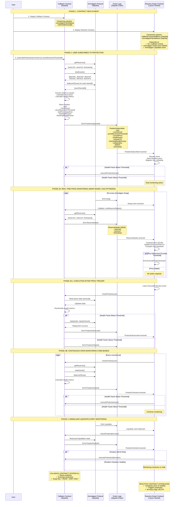

```mermaid
sequenceDiagram
    participant User
    participant CallbackContract as Callback Contract<br/>(Sepolia)
    participant AmmalgamPair as Ammalgam Protocol<br/>(Sepolia)
    participant Events as Event Logs<br/>(Sepolia Chain)
    participant ReactiveContract as Reactive Smart Contract<br/>(Lasna Testnet)

    Note over User,ReactiveContract: PHASE 1: CONTRACT DEPLOYMENT

    User->>CallbackContract: 1. Deploy Callback Contract
    Note over CallbackContract: Constructor params:<br/>- ammalgamPairAddress<br/>- tokenAddresses[6]

    User->>ReactiveContract: 2. Deploy Reactive Contract
    Note over ReactiveContract: Constructor params:<br/>- callbackContractAddress (Sepolia)<br/>- ammalgamPairAddress (Sepolia)<br/><br/>Subscribe to:<br/>✓ ALL Callback events<br/>✓ Ammalgam Swap event (NEW)<br/>✓ Ammalgam Liquidate event

    Note over User,ReactiveContract: PHASE 2: USER SUBSCRIBES TO PROTECTION

    User->>CallbackContract: 3. subscribeProtection(cronInterval, priceMovementThreshold)

    CallbackContract->>AmmalgamPair: getReserves()
    AmmalgamPair-->>CallbackContract: (reserveX, reserveY, timestamp)

    CallbackContract->>AmmalgamPair: totalAssets()
    AmmalgamPair-->>CallbackContract: [depositL, depositX, depositY,<br/>borrowL, borrowX, borrowY]

    CallbackContract->>AmmalgamPair: balanceOf(user) for each token[6]
    AmmalgamPair-->>CallbackContract: [userShares[6]]

    CallbackContract->>CallbackContract: Convert shares to assets<br/>Calculate tick & price<br/>Calculate health metrics

    CallbackContract->>CallbackContract: Store Position:<br/>- user<br/>- cronInterval<br/>- priceMovementThreshold<br/>- lastPrice (baseline)<br/>- lastHealthFactor<br/>- thresholdHealthFactor

    CallbackContract->>Events: Emit PositionSubscribed
    Note over Events: PositionSubscribed:<br/>- user<br/>- cronInterval<br/>- priceMovementThreshold<br/>- currentPrice<br/>- healthFactor<br/>- currentLTV<br/>- thresholdHealthFactor<br/>- collateralInL<br/>- debtInL<br/>- timestamp

    Events-->>ReactiveContract: PositionSubscribed received

    ReactiveContract->>ReactiveContract: Decode event<br/>Store baseline price<br/>Register cron schedule

    alt Health Factor Below Threshold
        ReactiveContract->>CallbackContract: executeProtection(user)
    else Health Factor Above Threshold
        Note over ReactiveContract: Dual monitoring active
    end

    Note over User,ReactiveContract: PHASE 3A: REAL-TIME PRICE MONITORING (SWAP-BASED, GAS OPTIMIZED)

    loop On every Ammalgam Swap
        AmmalgamPair->>Events: Emit Swap
        Events-->>ReactiveContract: Swap event received

        ReactiveContract->>CallbackContract: Callback: emitReserveDetails()

        CallbackContract->>AmmalgamPair: getReserves()
        AmmalgamPair-->>CallbackContract: (reserveX, reserveY, timestamp)

        CallbackContract->>Events: Emit ReserveDetails
        Note over Events: ReserveDetails (NEW):<br/>- reserveX<br/>- reserveY<br/>- timestamp

        Events-->>ReactiveContract: ReserveDetails received

        ReactiveContract->>ReactiveContract: Compute price (Q128)<br/>Update price movement %<br/>Compare with threshold

        alt Price Movement Exceeds Threshold
            ReactiveContract->>ReactiveContract: Emit ExecuteProtection(user)
        else Price Stable
            Note over ReactiveContract: No action required
        end
    end

    Note over User,ReactiveContract: PHASE 3A.1: EXECUTION AFTER PRICE TRIGGER

    ReactiveContract->>ReactiveContract: Listen ExecuteProtection event
    ReactiveContract->>CallbackContract: checkPosition(user)

    CallbackContract->>AmmalgamPair: Read latest state atomically
    AmmalgamPair-->>CallbackContract: Updated state

    CallbackContract->>CallbackContract: Recalculate health metrics

    alt Health Factor Below Threshold
        CallbackContract->>AmmalgamPair: repay(user, repayAmount)
        AmmalgamPair-->>CallbackContract: Repayment success

        CallbackContract->>Events: Emit ProtectionExecuted
        Events-->>ReactiveContract: ProtectionExecuted received
    else Health Factor Above Threshold
        CallbackContract->>Events: Emit PositionChecked
    end

    Note over User,ReactiveContract: PHASE 3B: CONTINUOUS CRON MONITORING (TIME-BASED)

    loop Every cronInterval
        ReactiveContract->>CallbackContract: checkPosition(user)

        CallbackContract->>AmmalgamPair: getReserves()
        CallbackContract->>AmmalgamPair: totalAssets()
        CallbackContract->>AmmalgamPair: balanceOf(user)

        CallbackContract->>CallbackContract: Calculate health metrics
        CallbackContract->>Events: Emit PositionChecked

        Events-->>ReactiveContract: PositionChecked received

        alt Health Factor Below Threshold
            ReactiveContract->>CallbackContract: executeProtection(user)
        else Health Factor Above Threshold
            Note over ReactiveContract: Continue monitoring
        end
    end

    Note over User,ReactiveContract: PHASE 4: AMMALGAM LIQUIDATE EVENT MONITORING

    AmmalgamPair->>Events: Emit Liquidate
    Events-->>ReactiveContract: Liquidate event detected

    ReactiveContract->>CallbackContract: checkPosition(borrower)

    CallbackContract->>AmmalgamPair: Read post-liquidation state
    CallbackContract->>Events: Emit PositionChecked

    Events-->>ReactiveContract: PositionChecked received

    alt Position Still At Risk
        ReactiveContract->>CallbackContract: executeProtection(borrower)
    else Position Closed or Healthy
        Note over ReactiveContract: Monitoring continues or ends
    end

    Note over CallbackContract: CALLBACK CONTRACT (STATEFUL)<br/>✓ Stores positions<br/>✓ Executes protection<br/>✓ Swap flow = READ + EMIT ONLY

    Note over ReactiveContract: REACTIVE CONTRACT (STATELESS)<br/>✓ Computes price & volatility<br/>✓ Triggers protection<br/>✓ All heavy logic off ETH
```
