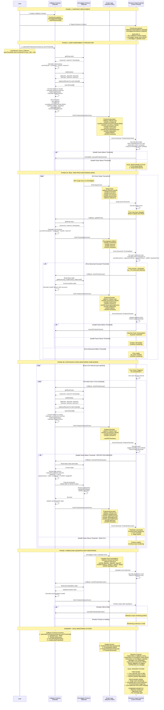

```mermaid
sequenceDiagram
    participant User
    participant CallbackContract as Callback Contract<br/>(Sepolia)
    participant AmmalgamPair as Ammalgam Protocol<br/>(Sepolia)
    participant Events as Event Logs<br/>(Sepolia Chain)
    participant ReactiveContract as Reactive Smart Contract<br/>(Lasna Testnet)
    
    Note over User,ReactiveContract: PHASE 1: CONTRACT DEPLOYMENT
    
    User->>CallbackContract: 1. Deploy Callback Contract
    Note over CallbackContract: Constructor params:<br/>- ammalgamPairAddress<br/>- tokenAddresses[6]
    
    User->>ReactiveContract: 2. Deploy Reactive Contract
    Note over ReactiveContract: Constructor params:<br/>- callbackContractAddress (Sepolia)<br/>- ammalgamPairAddress (Sepolia)<br/><br/>Subscribe to:<br/>✓ ALL Callback Contract events<br/>✓ Ammalgam Swap event (NEW)<br/>✓ Ammalgam Liquidate event
    
    Note over User,ReactiveContract: PHASE 2: USER SUBSCRIBES TO PROTECTION
    
    User->>CallbackContract: 3. subscribeProtection(cronInterval, priceThreshold)
    Note over User: cronInterval: 12sec to 28hours<br/>priceThreshold: price movement % (e.g., 200 = 2%)
    
    CallbackContract->>AmmalgamPair: getReserves()
    AmmalgamPair-->>CallbackContract: (reserveX, reserveY, timestamp)
    
    CallbackContract->>CallbackContract: Calculate current price:<br/>priceInQ128 = (reserveX * Q128) / reserveY
    
    CallbackContract->>AmmalgamPair: totalAssets()
    AmmalgamPair-->>CallbackContract: [depositL, depositX, depositY,<br/>borrowL, borrowX, borrowY]
    
    CallbackContract->>AmmalgamPair: balanceOf(user) for each token[6]
    AmmalgamPair-->>CallbackContract: [userShares[6]]
    
    CallbackContract->>CallbackContract: Convert shares to assets<br/>Calculate tick from reserves<br/>Build InputParams<br/>Calculate Health Metrics
    
    CallbackContract->>CallbackContract: Store Position:<br/>- user address<br/>- cronInterval<br/>- priceMovementThreshold (NEW)<br/>- lastPrice (NEW - baseline)<br/>- lastHealthFactor<br/>- thresholdHealthFactor
    
    CallbackContract->>Events: Emit PositionSubscribed Event
    Note over Events: PositionSubscribed:<br/>- address indexed user<br/>- uint256 cronInterval<br/>- uint256 priceMovementThreshold (NEW)<br/>- uint256 currentPrice (NEW)<br/>- uint256 healthFactor<br/>- uint256 currentLTV<br/>- uint256 thresholdHealthFactor<br/>- uint256 collateralInL<br/>- uint256 debtInL<br/>- uint256 timestamp
    
    Events-->>ReactiveContract: Event Received: PositionSubscribed
    
    ReactiveContract->>ReactiveContract: Decode event data<br/>Store baseline price for user<br/>Subscribe to cron schedule<br/>Check if immediate action needed
    
    alt Health Factor Below Threshold
        ReactiveContract->>CallbackContract: Immediate: executeProtection(user)
    else Health Factor Above Threshold
        Note over ReactiveContract: DUAL MONITORING ACTIVE:<br/>1. Cron-based (time)<br/>2. Swap-based (price)
    end
    
    Note over User,ReactiveContract: PHASE 3A: REAL-TIME PRICE MONITORING (NEW)
    
    loop On Every Swap Transaction
        Note over AmmalgamPair: ANY swap occurs on Ammalgam
        
        AmmalgamPair->>Events: Emit Swap Event
        Note over Events: Swap Event:<br/>- address indexed sender<br/>- uint256 amountXIn<br/>- uint256 amountYIn<br/>- uint256 amountXOut<br/>- uint256 amountYOut<br/>- address indexed to
        
        Events-->>ReactiveContract: Swap Event Received
        
        ReactiveContract->>ReactiveContract: Decode Swap event
        Note over ReactiveContract: Price may have changed<br/>Need to update and check
        
        ReactiveContract->>CallbackContract: Callback: updatePrice()
        
        CallbackContract->>AmmalgamPair: getReserves()
        AmmalgamPair-->>CallbackContract: (reserveX, reserveY, timestamp)
        
        CallbackContract->>CallbackContract: Calculate current price:<br/>currentPriceInQ128 = (reserveX * Q128) / reserveY
        
        CallbackContract->>Events: Emit PriceUpdated Event
        Note over Events: PriceUpdated (NEW):<br/>- uint256 currentPrice<br/>- uint256 reserveX<br/>- uint256 reserveY<br/>- uint256 timestamp
        
        Events-->>ReactiveContract: Event Received: PriceUpdated
        
        ReactiveContract->>ReactiveContract: For each monitored user:<br/>Calculate price movement %<br/>priceMovement = abs(currentPrice - baselinePrice) * 10000 / baselinePrice
        
        alt Price Movement Exceeds Threshold
            Note over ReactiveContract: Price moved > threshold!<br/>e.g., 2% movement detected
            
            ReactiveContract->>CallbackContract: Callback: checkPosition(user)
            
            CallbackContract->>AmmalgamPair: Read latest state:<br/>getReserves(), totalAssets(), balanceOf()
            AmmalgamPair-->>CallbackContract: Current position data
            
            CallbackContract->>CallbackContract: Calculate Health Metrics with new price
            
            CallbackContract->>Events: Emit PositionChecked Event
            Note over Events: PositionChecked:<br/>- address indexed user<br/>- uint256 currentPrice (NEW)<br/>- uint256 healthFactor<br/>- uint256 currentLTV<br/>- uint256 thresholdHealthFactor<br/>- uint256 collateralInL<br/>- uint256 debtInL<br/>- uint256 timestamp
            
            Events-->>ReactiveContract: Event Received: PositionChecked
            
            ReactiveContract->>ReactiveContract: Update baseline price<br/>Check health threshold
            
            alt Health Factor Below Threshold
                ReactiveContract->>CallbackContract: executeProtection(user)
                Note over ReactiveContract: PROTECTION TRIGGERED<br/>by price movement
            else Health Factor Above Threshold
                Note over ReactiveContract: Position still healthy<br/>Continue monitoring
            end
            
        else Price Movement Within Threshold
            Note over ReactiveContract: Price stable<br/>No action needed<br/>Continue monitoring
        end
    end
    
    Note over User,ReactiveContract: PHASE 3B: CONTINUOUS CRON MONITORING (TIME-BASED)
    
    loop Every Cron Interval (user-specific)
        Note over ReactiveContract: Cron Event Triggered<br/>for cronInterval X
        
        ReactiveContract->>ReactiveContract: Get users for this interval
        
        loop For Each User in Cron Schedule
            ReactiveContract->>CallbackContract: Callback: checkPosition(user)
            
            CallbackContract->>AmmalgamPair: getReserves()
            AmmalgamPair-->>CallbackContract: (reserveX, reserveY, timestamp)
            
            CallbackContract->>AmmalgamPair: totalAssets()
            AmmalgamPair-->>CallbackContract: [depositL, depositX, depositY,<br/>borrowL, borrowX, borrowY]
            
            CallbackContract->>AmmalgamPair: balanceOf(user) for each token[6]
            AmmalgamPair-->>CallbackContract: [userShares[6]]
            
            CallbackContract->>CallbackContract: Convert shares to assets<br/>Calculate current price and tick<br/>Build InputParams<br/>Calculate Health Metrics
            
            CallbackContract->>Events: Emit PositionChecked Event
            Note over Events: PositionChecked:<br/>- address indexed user<br/>- uint256 currentPrice (NEW)<br/>- uint256 healthFactor<br/>- uint256 currentLTV<br/>- ...<br/>- uint256 timestamp
            
            Events-->>ReactiveContract: Event Received: PositionChecked
            
            ReactiveContract->>ReactiveContract: Decode event<br/>Update baseline price (NEW)<br/>Check health threshold
            
            alt Health Factor Below Threshold - PROTECTION NEEDED
                ReactiveContract->>CallbackContract: Callback: executeProtection(user)
                
                CallbackContract->>AmmalgamPair: Read latest state atomically
                AmmalgamPair-->>CallbackContract: Current state
                
                CallbackContract->>CallbackContract: Recalculate metrics<br/>Calculate protection amount:<br/>targetHF = 1.5e18<br/>repayAmount = debt - (collateral * LTVMAX / targetHF)
                
                CallbackContract->>AmmalgamPair: Execute protection<br/>(repay debt on behalf of user)
                
                AmmalgamPair->>AmmalgamPair: Process repayment<br/>validateOnUpdate()<br/>Update saturation
                AmmalgamPair-->>CallbackContract: Success
                
                CallbackContract->>CallbackContract: Update stored position data
                
                CallbackContract->>Events: Emit ProtectionExecuted Event
                Note over Events: ProtectionExecuted:<br/>- address indexed user<br/>- uint256 repaidAmount<br/>- uint256 repaidAssetType<br/>- uint256 oldHealthFactor<br/>- uint256 newHealthFactor<br/>- uint256 gasUsed<br/>- uint256 timestamp
                
                Events-->>ReactiveContract: Event Received: ProtectionExecuted
                Note over ReactiveContract: Protection successful<br/>Continue dual monitoring:<br/>1. Cron schedule<br/>2. Swap events
                
            else Health Factor Above Threshold - HEALTHY
                Note over ReactiveContract: Position healthy<br/>Continue dual monitoring
            end
        end
    end
    
    Note over User,ReactiveContract: PHASE 4: AMMALGAM LIQUIDATE EVENT MONITORING
    
    AmmalgamPair->>Events: Ammalgam emits: Liquidate Event
    Note over Events: Liquidate (from Ammalgam):<br/>- address indexed borrower<br/>- address indexed to<br/>- uint256 depositL, depositX, depositY<br/>- uint256 repayLX, repayLY, repayX, repayY<br/>- uint256 liquidationType
    
    Events-->>ReactiveContract: Liquidate event detected
    
    ReactiveContract->>ReactiveContract: Decode liquidation event<br/>Check if monitored user
    
    ReactiveContract->>CallbackContract: Callback: checkPosition(borrower)
    
    CallbackContract->>AmmalgamPair: Read post-liquidation state
    AmmalgamPair-->>CallbackContract: Updated position data
    
    CallbackContract->>CallbackContract: Calculate post-liquidation health
    
    CallbackContract->>Events: Emit PositionChecked Event
    
    Events-->>ReactiveContract: Position status after liquidation
    
    alt Position Still At Risk
        ReactiveContract->>CallbackContract: executeProtection(borrower)
        Note over ReactiveContract: Attempt to save remaining position
    else Position Closed or Healthy
        Note over ReactiveContract: Monitoring continues or ends
    end
    
    Note over User,ReactiveContract: SUMMARY - DUAL MONITORING SYSTEM
    
    Note over CallbackContract: Callback Contract Functions:<br/>1. subscribeProtection(cronInterval, priceThreshold)<br/>2. updatePrice() - NEW<br/>3. checkPosition(user)<br/>4. executeProtection(user)<br/>5. unsubscribeProtection()
    
    Note over Events: Emitted Events:<br/>1. PositionSubscribed (enhanced)<br/>2. PriceUpdated (NEW)<br/>3. PositionChecked (enhanced)<br/>4. ProtectionExecuted
    
    Note over ReactiveContract: Reactive Contract:<br/>- Subscribes to Callback events<br/>- Subscribes to Ammalgam Swap (NEW)<br/>- Subscribes to Ammalgam Liquidate<br/>- Manages cron scheduling<br/>- Tracks price movements (NEW)<br/>- Sends callbacks on triggers<br/>- STATELESS (no storage)
    
    Note over ReactiveContract: DUAL TRIGGER SYSTEM:<br/><br/>TIME-BASED:<br/>✓ Cron intervals (12s to 28h)<br/>✓ Guaranteed periodic checks<br/>✓ Catches gradual degradation<br/><br/>PRICE-BASED (NEW):<br/>✓ Swap event monitoring<br/>✓ Immediate price shock detection<br/>✓ Threshold-based triggering<br/>✓ Cost-optimized (only when needed)<br/><br/>COMBINED BENEFITS:<br/>→ Maximum protection<br/>→ Optimized costs<br/>→ No coverage gaps
```
